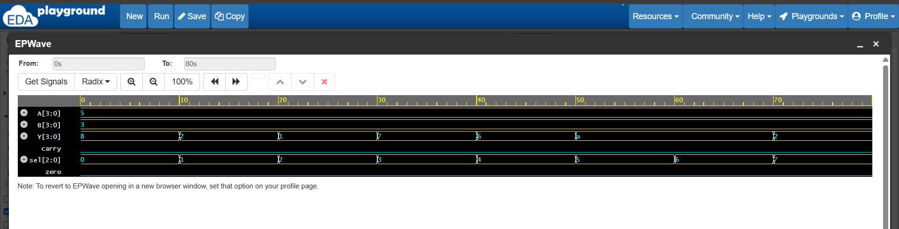

# 4-bit ALU using Verilog

## Overview

This project implements a 4-bit Arithmetic Logic Unit (ALU) using Verilog HDL.

The ALU performs arithmetic, logical, and shift operations based on a 3-bit select input.

## Features

- 4-bit input operands A and B
- 3-bit operation selection
- Arithmetic operations
- Logic operations
- Shift operations
- Carry output
- Zero flag
- Functional verification using a Verilog testbench
- Waveform verification using EPWave

## ALU Operations

| Select | Operation |
|--------|-----------|
| 000 | Addition |
| 001 | Subtraction |
| 010 | AND |
| 011 | OR |
| 100 | XOR |
| 101 | NOT A |
| 110 | Left Shift |
| 111 | Right Shift |

## Tools & Technologies

- Verilog/SystemVerilog
- Icarus Verilog
- EDA Playground
- EPWave

## Simulation

The ALU was simulated with different select inputs to verify all eight operations.

Example inputs:

- A = 0101 (5)
- B = 0011 (3)

The simulation results were verified using the testbench and waveform.

## Waveform

## EDA Playground 
[Open the ALU simulation on EDA Playground ]
(https://edaplayground.com/x/6c7S)

## Project Files

- `design.sv` — 4-bit ALU design
- `testbench.sv` — Testbench for functional verification
- `waveform.png` — Simulation waveform
